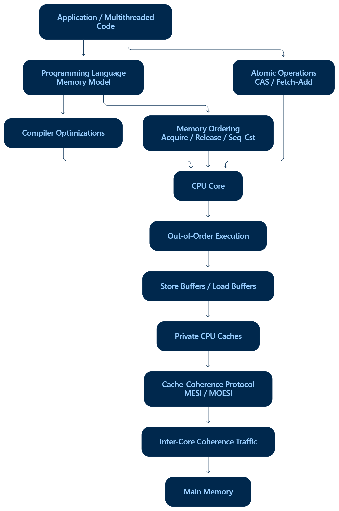

# EPAM Systems | High-Performance Systems & Architecture Practice
## Hardware Concurrency, Memory Models & Lock-Free Design: From Transistors to High-Throughput Software

**Document Status:** Official Research Paper & Technical Engineering Report  
**Author:** EPAM Systems Architecture & Concurrency Center of Excellence (CoE)  
**Target Platform:** Modern Multi-Core x86-64 (Intel/AMD) & ARM64 (Neoverse / Apple Silicon)  
**Language Specification:** C++11 / C++17 / C++20 Standard Memory Model  

---

## Table of Contents
1. [Executive Summary & Architectural Foundations](#1-executive-summary--architectural-foundations)
   - 1.1 The Hardware Reality vs. The Abstract Programmer Mental Model
   - 1.2 The Three Layers of Concurrent Engineering
2. [Instruction Reordering & Memory Ordering: Down to the Silicon](#2-instruction-reordering--memory-ordering-down-to-the-silicon)
   - 2.1 The Two Roots of Reordering: Compiler Optimizations & Out-of-Order (OoO) Pipelines
   - 2.2 Why Data Races Slip Past Unit Tests (x86-TSO vs. Weak Architectures)
   - 2.3 The Classic Litmus Test: Message Passing Race
   - 2.4 Microarchitectural Anatomy: Store Buffers & Invalidate Queues
   - 2.5 Hardware Action of Memory Fences: Acquire, Release, and Sequential Consistency
   - 2.6 Comparative Memory Order Reference Table
3. [Cache Coherence (MESI / MOESI) & Cache-Line Bouncing](#3-cache-coherence-mesi--moesi--cache-line-bouncing)
   - 3.1 Principles of Cache Coherence: Line Granularity & Protocol States
   - 3.2 Formal MESI/MOESI State Transitions and Bus Transactions
   - 3.3 Critical Architectural Axiom: Coherence $\neq$ Consistency
   - 3.4 The False Sharing Pathology: Physical Collisions of Independent Data
   - 3.5 Latency Breakdown: L1 Hit vs. Interconnect Ping-Pong
   - 3.6 Hardware Padding & Cache Alignment Remediation
4. [Lock-Free Scaling, Atomic Primitives & Ring Buffers](#4-lock-free-scaling-atomic-primitives--ring-buffers)
   - 4.1 Compare-And-Swap (CAS): The Silicon Primitive
   - 4.2 Kernel Context Switch Elimination: Mutex Blocking vs. User-Space Retries
   - 4.3 The ABA Hazard: Mechanism, Demonstration, and Tagged Pointer Defense
   - 4.4 The LMAX Disruptor Architecture: Mechanical Sympathy in Practice
5. [The Quest: Silicon-Level Wire Trace of a Memory Race](#5-the-quest-silicon-level-wire-trace-of-a-memory-race)
   - 5.1 Cycle-by-Cycle Microarchitectural Interleaving Table
   - 5.2 State Machine Repair via Acquire/Release Synchronization
6. [Production-Ready Code Reference & Benchmarks](#6-production-ready-code-reference--benchmarks)
   - 6.1 Litmus Message Passing: Broken vs. Synchronized
   - 6.2 False Sharing Benchmark & Cache Padding
   - 6.3 High-Throughput SPSC Lock-Free Ring Buffer
   - 6.4 Double-Word CAS (ABA Prevention)
7. [Production Hardware Profiling & Observability Runbook](#7-production-hardware-profiling--observability-runbook)
   - 7.1 Linux `perf c2c` (Cache-to-Cache) Diagnostic Playbook
   - 7.2 Intel VTune Memory Access & False Sharing Profiling
   - 7.3 Clang ThreadSanitizer (TSAN) Integration
8. [EPAM Team Insights & Senior Engineering Guidelines](#8-epam-team-insights--senior-engineering-guidelines)
   - 8.1 The Three Core Architectural Questions
   - 8.2 Production Design Checklist

---

# 1. Executive Summary & Architectural Foundations

### 1.1 The Hardware Reality vs. The Abstract Programmer Mental Model
Most software engineers learn concurrent programming through the lens of **Sequential Consistency (SC)**: a model where all operations from all threads execute in some global, interleaved sequential order, and where a write by Thread A is instantly visible to Thread B. 

While conceptually intuitive, this illusion completely disintegrates on modern multi-core microprocessors. 

```
┌────────────────────────────────────────────────────────────────────────┐
│                      NAIVE PROGRAMMER EXPECTATION                      │
│                                                                        │
│   Thread 1:  [Write Data = 42] ───────────► [Write Ready = true]       │
│                                                     │                  │
│                                             (Instant Sync)             │
│                                                     ▼                  │
│   Thread 2:  [Read Ready == true] ────────► [Read Data == 42]          │
└────────────────────────────────────────────────────────────────────────┘

┌────────────────────────────────────────────────────────────────────────┐
│                        PHYSICAL SILICON REALITY                        │
│                                                                        │
│   Core 0:    [Compiler Reordering] ──► [Store Buffer Queue]            │
│                       │                         │ (Delayed Drain)      │
│                       ▼                         ▼                      │
│   Coherence: [Private L1 Cache] ◄──► [Interconnect / MESI Invalidate]  │
│                       ▲                         │ (Queued Inval)       │
│                       │                         ▼                      │
│   Core 1:    [Invalidate Queue] ◄──► [Speculative Load Engine]         │
└────────────────────────────────────────────────────────────────────────┘
```

Modern high-performance computer architectures sacrifice instantaneous visibility to maximize single-thread throughput:
1. **Compilers** reorder instructions during register allocation, dead-code elimination, and loop scheduling.
2. **Out-of-Order (OoO) CPU pipelines** execute instructions speculatively ahead of retirement.
3. **Store Buffers** decouple high-speed CPU execution units from slow L1/L2 cache write cycles.
4. **Invalidate Queues** acknowledge cache invalidation requests before updating private L1 lines.
5. **Private Multi-Tier Caches** operate strictly at **64-byte cache line granularity**, triggering cross-core coherence contention even when threads write to disjoint variables.

Developing fault-tolerant, microsecond-latency trading platforms, streaming engines, and enterprise infrastructures demands **Mechanical Sympathy**: understanding hardware execution pipelines down to the physical wire.

---

### 1.2 The Three Layers of Concurrent Engineering
To reason systematically about concurrency, EPAM's Architecture CoE categorizes high-performance concurrent design into three distinct, non-overlapping architectural layers:


*Figure 1.1: The Three Layers of Concurrency — Correctness, Coherence, and Performance.*

```
                 ┌───────────────────────────────────────────────┐
                 │             LAYER 1: CORRECTNESS              │
                 │         Programming Memory Models             │
                 │      (Acquire / Release, Seq-Cst, C++11)      │
                 └───────────────────────┬───────────────────────┘
                                         │
                                         ▼
                 ┌───────────────────────────────────────────────┐
                 │              LAYER 2: COHERENCE               │
                 │          Hardware Cache Protocols             │
                 │    (MESI / MOESI, Invalidation, Ownership)    │
                 └───────────────────────┬───────────────────────┘
                                         │
                                         ▼
                 ┌───────────────────────────────────────────────┐
                 │             LAYER 3: PERFORMANCE              │
                 │          Microarchitectural Tuning            │
                 │   (Cache Padding, CAS Loops, Ring Buffers)    │
                 └───────────────────────┬───────────────────────┘
                                         │
                                         ▼
                 ┌───────────────────────────────────────────────┐
                 │     HIGH-THROUGHPUT, SCALABLE ARCHITECTURE    │
                 └───────────────────────────────────────────────┘
```


*Figure 1.2: End-to-End System Hierarchy: From Multithreaded Software to Silicon Coherence.*


*Figure 1.3: Vertical Stack: Programming Memory Model, Compiler, CPU Pipelines, Caches, and Main Memory.*

---

# 2. Instruction Reordering & Memory Ordering: Down to the Silicon

### 2.1 The Two Roots of Reordering: Compiler Optimizations & Out-of-Order (OoO) Pipelines
Instruction reordering occurs independently at two levels: software compile time and microarchitectural runtime.

```
+-----------------------------------------------------------------------------------------+
|                                SOURCES OF REORDERING                                    |
+------------------------------------+----------------------------------------------------+
| 1. COMPILER REORDERING             | 2. CPU HARDWARE / OoO PIPELINE REORDERING          |
+------------------------------------+----------------------------------------------------+
| • Register Allocation & Spilling   | • Out-of-Order Reservation Stations (RS)           |
| • Common Subexpression Elimination | • Store Buffering (FIFO buffer between ALU & Cache)|
| • Loop Unrolling & Code Motion     | • Speculative Load Execution                       |
| • Instruction Pipelining           | • Invalidate Queues (Delayed invalidation apply)   |
| Guiding Rule:                      | Guiding Rule:                                      |
| "As-if" single-threaded rule       | Program order preserved for self-dependencies      |
+------------------------------------+----------------------------------------------------+
```

#### The "As-If" Rule
Compilers (GCC, Clang, MSVC) and hardware CPU pipelines operate under the **"as-if" rule**: an optimization or reordering is legally permitted if a single-threaded program observing the execution cannot distinguish the optimized sequence from the sequential source code. 

Because the compiler and the out-of-order execution engine assume single-threaded execution context, they treat memory stores and loads to independent addresses (e.g., `data` and `ready`) as completely unbound. If reordering improves pipeline utilization or hides memory latency, the execution sequence is rearranged.


*Figure 2.1: The Instruction Reordering Pipeline: Store Buffer delaying visibility between Producer and Consumer.*

---

### 2.2 Why Data Races Slip Past Unit Tests (x86-TSO vs. Weak Architectures)
Engineers frequently ask: *"Our multithreaded code passed 10,000 unit test cycles on developer workstations. Why did it crash with memory corruption within 10 minutes of deploying to AWS Graviton or Apple Silicon?"*

The answer lies in the fundamental disparity between **Hardware Memory Models**:

```
+────────────────────+─────────────────────────────+─────────────────────────────────────────+
| HARDWARE MODEL     | ALLOWED REORDERINGS         | REPRESENTATIVE ARCHITECTURES            |
+────────────────────+─────────────────────────────+─────────────────────────────────────────+
| Strict / SC        | None                        | Theoretical Lamport Sequential Machine  |
| Total Store Order  | Store-Load ONLY             | x86-64 (Intel Core / Xeon, AMD Zen)     |
| (x86-TSO)          | (Stores to different addrs  |                                         |
|                    |  can be delayed past loads) |                                         |
| Weak Ordering      | Load-Load, Load-Store,      | ARMv8 / ARM64, IBM POWER, RISC-V        |
|                    | Store-Store, Store-Load     |                                         |
+────────────────────+─────────────────────────────+─────────────────────────────────────────+
```

1. **On x86-64 (Total Store Order - TSO):**
   - The hardware microarchitecture guarantees that **stores are never reordered with other stores** ($Store \to Store$ order is preserved).
   - **Loads are never reordered with other loads** ($Load \to Load$ order is preserved).
   - The *only* reordering x86 hardware performs is allowing a load to execute before an earlier store to a different address has drained from the store buffer ($Store \to Load$ relaxation).
   - Consequently, ordinary non-atomic code for the classic "message-passing" pattern often executes correctly on x86 by pure hardware coincidence, giving developers a false sense of security.

2. **On ARM64 / POWER (Weakly Ordered):**
   - The CPU aggressively reorders $Store \to Store$ and $Load \to Load$.
   - A CPU core can commit `ready = true` to the coherence fabric before `data = 42` has left its store buffer.
   - The consumer core can speculatively pre-fetch `data` before it finishes reading `ready`.
   - The race manifests immediately under real-world multi-core loads.


*Figure 2.2: Sequence Diagram: Core 0 Store Buffer delay leading to stale data observation on Core 1.*

---

### 2.3 The Classic Litmus Test: Message Passing Race

```cpp
// SHARED GLOBAL STATE
int data = 0;
bool ready = false;

// Core 0 (Producer)              // Core 1 (Consumer)
void thread_producer() {          void thread_consumer() {
    data = 42;         // (1)         while (!ready) { /* spin */ } // (3)
    ready = true;      // (2)         int val = data;               // (4)
}                                     assert(val == 42);            // FAILS ON WEAK CPUS!
                                  }
```

#### How the Failure Manifests:
1. **Producer Side Reordering:** 
   The compiler or the OoO pipeline notices `data` and `ready` are distinct memory addresses. It executes `ready = true` first, or places `data = 42` into the store buffer while immediately asserting ownership of `ready`.
2. **Consumer Side Reordering:** 
   Core 1 speculatively executes `val = data` while waiting for the loop condition `!ready` to resolve. It reads the uninitialized value `0`. When `ready == true` finally arrives, it commits the speculatively loaded value `0`. The assertion fires: `assert(0 == 42)`.

---

### 2.4 Microarchitectural Anatomy: Store Buffers & Invalidate Queues
To understand memory barriers, we must examine what physically exists between the execution units (ALUs) and the Level 1 Data Cache:

```
┌──────────────────────────────────────────────────────────────────────────────┐
│                            CPU CORE MICROARCHITECTURE                        │
│                                                                              │
│    ┌───────────────┐                              ┌───────────────┐          │
│    │  Load Buffer  │                              │ Store Buffer  │          │
│    │ (Speculative) │                              │    (FIFO)     │          │
│    └───────┬───────┘                              └───────┬───────┘          │
│            │                                              │                  │
│            ▼                                              ▼                  │
│    ┌──────────────────────────────────────────────────────────────┐          │
│    │                      L1 DATA CACHE                           │          │
│    └──────────────────────────────┬───────────────────────────────┘          │
│                                   │                                          │
│                                   ▼                                          │
│    ┌──────────────────────────────────────────────────────────────┐          │
│    │                      INVALIDATE QUEUE                        │          │
│    └──────────────────────────────┬───────────────────────────────┘          │
│                                   │                                          │
│                                   ▼                                          │
│    ┌──────────────────────────────────────────────────────────────┐          │
│    │               COHERENCE INTERCONNECT / BUS                   │          │
│    └──────────────────────────────────────────────────────────────┘          │
└──────────────────────────────────────────────────────────────────────────────┘
```

#### The Store Buffer
- When a CPU executes a store instruction, writing to the L1 cache requires ownership of the corresponding cache line (MESI `M` or `E` state).
- If the line is shared or invalid, waiting for a **Read-For-Ownership (RFO)** request across the bus takes 30–100 nanoseconds.
- To prevent the execution pipeline from stalling, the CPU pushes the write into a high-speed hardware FIFO: the **Store Buffer**.
- The core continues executing subsequent instructions immediately.
- **Store Forwarding:** If the local core reads an address it recently wrote, it reads directly from its own store buffer before the data hits L1 cache. However, other cores **cannot see** into this store buffer!

#### The Invalidate Queue
- When another core issues an RFO broadcast, this core must invalidate its local copy of that cache line.
- Invalidating an L1 line requires cache-tag lookups. If the L1 cache is busy serving high-speed load operations, processing invalidations immediately would stall the pipeline.
- Hardware designers added an **Invalidate Queue**: incoming invalidation requests are acknowledged immediately (sending an ACK back on the bus so the sender doesn't stall), but the actual cache line invalidation is queued to be applied when the cache is idle.
- **The Risk:** Between the ACK and the actual cache-tag invalidation, the local core can continue reading **stale data** from its L1 cache!

---

### 2.5 Hardware Action of Memory Fences: Acquire, Release, and Sequential Consistency
A memory barrier / fence is not a generic "flush all caches to RAM" command. It is a precise instruction to the CPU execution pipeline, Store Buffer, and Invalidate Queue:

```
+──────────────────────────+───────────────────────────────────────────────────────────────+
| FENCE TYPE               | PHYSICAL MICROARCHITECTURAL INSTRUCTION                       |
+──────────────────────────+───────────────────────────────────────────────────────────────+
| Store-Release            | 1. Forbids compiler from reordering earlier writes after it.  |
| (std::memory_order_      | 2. Flushes the local Store Buffer: all prior stores must      |
|  release)                |    drain to L1 cache before this store can become visible.    |
|                          | 3. On ARM64: Emits STLR instruction.                          |
|                          | 4. On x86: Compiler barrier only (hardware already guarantees)|
+──────────────────────────+───────────────────────────────────────────────────────────────+
| Load-Acquire             | 1. Forbids compiler from moving subsequent reads before it.   |
| (std::memory_order_      | 2. Drains the Invalidate Queue: forces application of pending |
|  acquire)                |    invalidations before subsequent loads execute.             |
|                          | 3. Flushes speculatively executed loads.                      |
|                          | 4. On ARM64: Emits LDAR instruction.                          |
|                          | 5. On x86: Compiler barrier only (hardware already guarantees)|
+──────────────────────────+───────────────────────────────────────────────────────────────+
| Full Barrier / Seq-Cst   | 1. Total order across all threads.                           |
| (std::memory_order_      | 2. Completely stalls instruction retirement until the Store   |
|  seq_cst)                |    Buffer is 100% drained and all bus invalidations commit.   |
|                          | 3. On x86: Emits MFENCE or LOCK prefix (e.g., LOCK CMPXCHG).  |
|                          | 4. On ARM64: Emits DMB ISH (Data Memory Barrier Inner Share). |
+──────────────────────────+───────────────────────────────────────────────────────────────+
```


*Figure 2.3: Acquire/Release Pipeline: Establishing the Synchronizes-With Relationship.*


*Figure 2.4: Formal Sequence Diagram of Acquire-Release establishing Happens-Before.*


*Figure 2.5: Architectural Taxonomy: Relaxed vs. Acquire/Release vs. Sequential Consistency.*

---

### 2.6 Comparative Memory Order Reference Table

| C++ Memory Order | Microarchitectural Guarantee | Compiler Motion Allowed | Hardware Instruction (x86-64) | Hardware Instruction (ARM64) | Typical Production Use Case |
| :--- | :--- | :--- | :--- | :--- | :--- |
| **`memory_order_relaxed`** | Atomicity only. No ordering guarantees between variables. | All independent loads/stores can move across. | Plain `mov` | Plain `ldr` / `str` | Diagnostics counters, metrics, sequence generators without data dependencies. |
| **`memory_order_consume`** | Data-dependency ordering (data dependent on loaded pointer). | Prevents dependent loads from moving before. | Plain `mov` | Plain `ldr` | Read-Copy-Update (RCU) pointer dereferences (rarely used; compilers promote to Acquire). |
| **`memory_order_acquire`** | One-way fence: No subsequent reads/writes can move *before* this load. | Earlier ops can move after; later ops *cannot* move before. | Compiler barrier (`asm volatile("" ::: "memory")`) | `ldar` (Load-Acquire Register) | Consumer polling, mutex locks, observing published data structures. |
| **`memory_order_release`** | One-way fence: No prior reads/writes can move *after* this store. | Earlier ops *cannot* move after; later ops can move before. | Compiler barrier (`asm volatile("" ::: "memory")`) | `stlr` (Store-Release Register) | Producer publication, mutex unlocks, publishing initialized data. |
| **`memory_order_acq_rel`** | Bi-directional: Combines Acquire (for reads) and Release (for writes). | Neither earlier ops can pass after, nor later ops pass before. | Compiler barrier | `ldaxr` / `stlxr` pairs | Read-Modify-Write operations (`fetch_add`, `compare_exchange`) in lock-free lists. |
| **`memory_order_seq_cst`** | Single global total order agreed upon by all CPU cores. | Strict: no reordering permitted across fence boundary. | `lock cmpxchg` or `mfence` | `dmb ish` (full system barrier) | Default C++ atomics; state machines requiring global agreement across cores. |

---

# 3. Cache Coherence (MESI / MOESI) & Cache-Line Bouncing

### 3.1 Principles of Cache Coherence: Line Granularity & Protocol States
In modern multi-core systems, main memory is high-latency (50–100 ns), so each core maintains dedicated Level 1 (L1) and Level 2 (L2) caches (1–4 ns).

```
   ┌───────────────────────┐             ┌───────────────────────┐
   │      Core 0 (CPU)     │             │      Core 1 (CPU)     │
   └───────────┬───────────┘             └───────────┬───────────┘
               │                                     │
   ┌───────────▼───────────┐             ┌───────────▼───────────┐
   │   L1 Data Cache (32KB)│             │   L1 Data Cache (32KB)│
   └───────────┬───────────┘             └───────────┬───────────┘
               │                                     │
               └──────────────┬──────────────────────┘
                              │
               ┌──────────────▼──────────────────────┐
               │    Coherence Interconnect / Bus     │
               │  (Broadcast / Directory Snooping)   │
               └──────────────┬──────────────────────┘
                              │
               ┌──────────────▼──────────────────────┐
               │         Shared L3 Cache / LLC       │
               └─────────────────────────────────────┘
```

To maintain a consistent view of memory, hardware employs cache coherence protocols. The fundamental unit of cache interaction is the **Cache Line**, standardized at **64 bytes** across Intel, AMD, and ARM architectures.


*Figure 3.1: The Four MESI States: Modified, Exclusive, Shared, and Invalid.*

---

### 3.2 Formal MESI/MOESI State Transitions and Bus Transactions

| State | Line Status | Memory Alignment | Read Ability | Write Ability | Other Caches Have It? |
| :--- | :--- | :--- | :--- | :--- | :--- |
| **M (Modified)** | Dirty (Newest) | Out-of-sync with RAM | Yes | Yes (Instant L1 hit) | No (All others must be Invalid) |
| **O (Owner)** *(MOESI)* | Dirty (Shared) | Out-of-sync with RAM | Yes | No (Must upgrade to M) | Yes (Others hold state S) |
| **E (Exclusive)** | Clean (Fresh) | Synchronized with RAM| Yes | Yes (Transitions to M silently) | No (Only this cache has it) |
| **S (Shared)** | Clean | Synchronized with RAM| Yes | No (Must request RFO to write)| Yes (1 or more other cores have it)|
| **I (Invalid)** | Stale / Empty | N/A | No (Triggers Read Miss)| No (Triggers Write Miss) | Irrelevant |


*Figure 3.2: Formal State Transition Graph for the MESI Protocol.*


*Figure 3.3: Sequence Diagram: Core 0 acquiring exclusive ownership and invalidating Core 1.*

#### Microarchitectural Bus Events:
1. **`PrRd` (Processor Read):** CPU requests a read of address $X$.
2. **`PrWr` (Processor Write):** CPU requests a write to address $X$.
3. **`BusRd`:** Coherence broadcast inquiring if any other cache holds address $X$.
4. **`BusRdX` / `RFO` (Read-For-Ownership):** Broadcast announcing that this core intends to write to address $X$. Every other cache holding this line **must invalidate** its copy immediately.

---

### 3.3 Critical Architectural Axiom: Coherence $\neq$ Consistency
A frequent misconception among systems developers is assuming that a cache coherence protocol guarantees memory ordering.

> [!IMPORTANT]
> **Coherence $\neq$ Consistency (Memory Ordering).**  
> - **Cache Coherence (MESI)** guarantees **per-variable serialization**: every CPU core agrees on the sequential history of modifications to a *single 64-byte cache line*. It guarantees that memory will never hold two different valid values for the same memory address simultaneously.
> - **Memory Consistency (Memory Ordering)** governs the ordering rules between **two different memory addresses** ($X$ and $Y$). 
> 
> A hardware system can be 100% MESI-coherent and still reorder stores and loads between address $X$ and address $Y$ via store buffers and out-of-order execution pipelines.

---

### 3.4 The False Sharing Pathology: Physical Collisions of Independent Data
**False sharing** occurs when two distinct threads running on separate CPU cores modify independent variables that happen to reside within the **same 64-byte cache line**.

```
                           64-BYTE CACHE LINE
┌──────────────────────────────────────┬──────────────────────────────────────┐
│  Core 0 updates Counter A (8 bytes)  │  Core 1 updates Counter B (8 bytes)  │
└──────────────────────────────────────┴──────────────────────────────────────┘
                   ▲                                      ▲
                   │                                      │
              Core 0: WRITE                          Core 1: WRITE
                   │                                      │
                   ▼                                      ▼
           Broadcasts RFO                         Broadcasts RFO
       Invalidates Core 1 Cache               Invalidates Core 0 Cache
                   ▲                                      ▲
                   └──────────────────┬───────────────────┘
                                      │
                           CACHE-LINE PING-PONG!
                      (Throughput collapses by 100x)
```


*Figure 3.4: False Sharing: Two logically independent variables sharing one physical cache line.*


*Figure 3.5: Sequence Diagram: Inter-core Cache Line Ping-Pong across the coherence fabric.*

---

### 3.5 Latency Breakdown: L1 Hit vs. Interconnect Ping-Pong

```
+─────────────────────────────────────────+──────────────────+───────────────────+
| OPERATION TYPE                          | CPU CLOCK CYCLES | APPROX. REAL TIME |
+─────────────────────────────────────────+──────────────────+───────────────────+
| L1 Data Cache Hit (Local Modified/Excl) | 3 - 4 cycles     | ~0.9 - 1.2 ns     |
| L2 Cache Hit (Local)                    | 12 - 14 cycles   | ~3.5 - 4.2 ns     |
| L3 Cache Hit (Shared LLC)               | 38 - 50 cycles   | ~11 - 15 ns       |
| Cross-Core Cache-to-Cache Transfer      | 150 - 300 cycles | ~45 - 90 ns       |
| (HITM / Cache-Line Bouncing / RFO)      |                  |                   |
| Main Memory Access (DRAM Latency)       | 200 - 350 cycles | ~60 - 100 ns      |
+─────────────────────────────────────────+──────────────────+───────────────────+
```

When two threads update independent variables on the same cache line in tight loops, each write invalidates the other core's L1 cache. What should have executed as an L1 write hit (4 cycles) turns into an ongoing **Cache-to-Cache Hit Modified (`HITM`)** penalty (200+ cycles). 

Throughput collapses by **50× to 100×**, saturating the inter-socket interconnect (Intel UPI / AMD Infinity Fabric) with coherence arbitration packets.

---

### 3.6 Hardware Padding & Cache Alignment Remediation
The remedy for false sharing is physical separation: enforcing cache line isolation so that concurrent variables occupy separate 64-byte lines.


*Figure 3.6: Structural Transformation: Before (Co-located in Line 0) vs. After (Isolated in Line 0 & Line 1).*

#### Production C++ Implementation:
```cpp
// ANTI-PATTERN: Prone to Catastrophic False Sharing
struct UnpaddedCounters {
    std::atomic<uint64_t> producer_seq; // 8 bytes  \ Both occupy
    std::atomic<uint64_t> consumer_seq; // 8 bytes  / the same 64-byte line!
};

// PRODUCTION PATTERN: Enforced Hardware Alignment via alignas
struct alignas(64) PaddedSequence {
    std::atomic<uint64_t> value{0};
    // Standard 64-byte line padding
    uint8_t pad[64 - sizeof(std::atomic<uint64_t>)]; 
};

// C++17 Idiomatic Approach:
#include <new>
struct ModernPaddedCounter {
    alignas(std::hardware_destructive_interference_size) 
    std::atomic<uint64_t> counter{0};
};
```

---

# 4. Lock-Free Scaling, Atomic Primitives & Ring Buffers

### 4.1 Compare-And-Swap (CAS): The Silicon Primitive
Lock-free algorithms avoid mutual exclusion locks by relying on hardware-level **atomic Read-Modify-Write (RMW)** operations. The foundational primitive across all modern ISAs is **Compare-And-Swap (CAS)**.


*Figure 4.1: Flowchart: The Atomic Compare-And-Swap Operation and User-Space Retry Loop.*


*Figure 4.2: Sequence Diagram: Contention between Thread 1 and Thread 2 racing on CAS.*

#### Hardware ISA Mapping:
- **x86-64:** `LOCK CMPXCHG [rdi], rsi`. The `LOCK` prefix physically asserts cache line lock (via MESI cache protocol), preventing other cores from modifying the line between the compare and the swap.
- **ARM64:** Load-Linked / Store-Conditional primitives (`LDXR` / `STXR`) or modern ARMv8.1 Large System Extensions `CAS` instructions.

---

### 4.2 Kernel Context Switch Elimination: Mutex Blocking vs. User-Space Retries
Why do lock-free data structures dramatically outperform traditional `std::mutex` in low-latency systems?


*Figure 4.3: Decision Tree: Traditional Mutex (Kernel Context Switch) vs. Lock-Free CAS (User-Space Retry).*

```
+───────────────────────────+──────────────────────────────────+───────────────────────────────────+
| CHARACTERISTIC            | TRADITIONAL MUTEX (OS LOCK)      | LOCK-FREE CAS RETRY LOOP          |
+───────────────────────────+──────────────────────────────────+───────────────────────────────────+
| Execution Mode            | Transitions into Kernel Space    | 100% User-Space Execution         |
| Contention Behavior       | Thread put to sleep (Futex wait) | Spins / Retries immediately       |
| Latency Overhead          | ~1,500 – 5,000 ns (3 - 15 µs)    | ~5 – 25 ns                        |
| Scheduling Side Effects   | Thread Control Block (TCB) swap, | No thread descheduling; preserves |
|                           | TLB flush, L1/L2 cache pollution | CPU cache warmth                  |
| Priority Inversion Risk   | Severe without priority inher.   | Immune to Priority Inversion      |
+───────────────────────────+──────────────────────────────────+───────────────────────────────────+
```

---

### 4.3 The ABA Hazard: Mechanism, Demonstration, and Tagged Pointer Defense
The **ABA Problem** is a critical correctness vulnerability unique to lock-free CAS implementations:

1. Thread 1 reads pointer $X = A$.
2. Thread 1 is preempted by the OS.
3. Thread 2 modifies $X = B$, performs work, and then modifies $X$ back to $A$ (or frees node $A$, allocates a new node that happens to receive the exact same heap memory address $A$).
4. Thread 1 resumes and executes `CAS(&X, A, NewValue)`.
5. The CPU observes that $X$ still contains address $A$. The CAS succeeds!
6. **Catastrophe:** The internal state or topology of node $A$ was altered (or it points to freed memory), corrupting the data structure.


*Figure 4.4: Sequence Diagram: The ABA Hazard causing undetected state corruption.*

#### Remediation: Double-Word CAS (DW-CAS) with Tagged Pointers
To defeat ABA, every pointer is coupled with a monotonically increasing 64-bit generation counter:

```cpp
struct TaggedPointer {
    Node* ptr;         // 64-bit pointer
    uint64_t version;  // 64-bit monotonically increasing counter
};
// Atomically evaluated on x86 using CMPXCHG16B
```
Even if the pointer address returns to $A$, the version counter has advanced ($A_{v1} \to B_{v2} \to A_{v3}$). The CAS fails because $A_{v1} \neq A_{v3}$.

---

### 4.4 The LMAX Disruptor Architecture: Mechanical Sympathy in Practice
Created by LMAX Exchange for financial trading infrastructure processing 6,000,000 orders/sec at sub-microsecond latency, the Disruptor represents the pinnacle of cache-aware, lock-free architecture.


*Figure 4.5: High-Performance Lock-Free Ring Buffer Interaction Loop.*


*Figure 4.6: Architecture Diagram: The LMAX Disruptor Preallocated Ring Buffer & Sequencers.*

```
                       LMAX DISRUPTOR RING BUFFER
   ┌─────────────────────────────────────────────────────────────────┐
   │ [Slot 0]   [Slot 1]   [Slot 2]   [Slot 3]   [Slot 4]   [Slot 5] │
   └─────────────────────────────────────────────────────────────────┘
         ▲                                                 ▲
         │                                                 │
   Consumer Sequence                               Producer Sequence
   (Acquire-Load)                                  (Release-Store)
   alignas(64)                                     alignas(64)
```

#### Core Design Innovations:
1. **Pre-allocated Event Storage:** All queue elements are pre-allocated at startup. During runtime, zero memory allocations occur, eliminating garbage collection pauses and heap fragmentation.
2. **Modulo Optimization:** The ring buffer capacity $N$ is always a strict power of 2. Slot indexing replaces slow integer division (`pos % N`) with a single-cycle bitwise AND: `pos & (N - 1)`.
3. **Cache Line Isolation:** The Producer sequence counter and Consumer sequence counter are padded with 56 bytes of dummy data (`alignas(64)`), completely eliminating false sharing between producer and consumer cores.
4. **Acquire-Release Synchronization:** Eliminates heavy sequential consistency fences (`MFENCE`), maximizing hardware instruction pipelining.

---

# 5. The Quest: Silicon-Level Wire Trace of a Memory Race

### 5.1 Cycle-by-Cycle Microarchitectural Interleaving Table
To deconstruct an asymmetric memory race down to the wire, consider the message-passing scenario executed on two independent cores without memory barriers. The table below traces the exact state across silicon structures:

| Cycle | Core 0 (Producer) Pipeline | Core 0 Store Buffer | Coherence Bus / Fabric | Core 1 Invalidate Queue | Core 1 L1 Cache State | Core 1 (Consumer) Pipeline | Result / Hazard |
| :---: | :--- | :--- | :--- | :--- | :--- | :--- | :--- |
| **T0** | `data = 42` (Store) | Holds `[data=42]` | Idle | Empty | `data: Shared (0)`, `ready: Shared (0)` | Idle | Store buffered to avoid core stall. |
| **T1** | `ready = 1` (Store) | Holds `[ready=1]` | `BusRdX` (RFO for `ready`) sent | Empty | `ready` line invalidated on bus | `while(!ready)` executes | Bus arbitrates ownership. |
| **T2** | Core 0 commits `ready` | Flushes `[ready=1]` | Data transfer for `ready` | Receives Inval for `ready` | `ready` set to Invalid | Reading `ready` stalls on miss | `data=42` is STILL in Core 0 Store Buffer! |
| **T3** | Idle | Holds `[data=42]` | Core 1 sends `BusRd` for `ready` | Acknowledges Inval for `ready` | Core 1 loads `ready=1` from Core 0 | `while(!ready)` loop terminates! | Consumer proceeds to read `data`. |
| **T4** | Idle | Holds `[data=42]` | Idle | Inval for `data` NOT sent | `data` remains in **Shared (0)** state! | Executes `val = data` | Core 1 reads stale `data = 0` directly from L1! |
| **T5** | Core 0 drains `[data=42]` | Store buffer empty | `BusRdX` for `data` sent | Receives Inval for `data` | `data` set to Invalid | `assert(val == 42)` **FIRES!** | **FATAL RACE OCCURRED.** |

---

### 5.2 State Machine Repair via Acquire/Release Synchronization
When synchronized with proper memory orders, the silicon behavior changes:

```
PRODUCER CORE 0                                                CONSUMER CORE 1
──────────────────────────────────────────────────────────────────────────────
1. data = 42; 
   (Pushed to Store Buffer)
   
2. ready.store(true, memory_order_release);
   [HARDWARE ACTION]
   Flushes all prior stores out of Store Buffer!
   Drains [data = 42] into L1 Cache (State M).
   Issues BusRdX for both lines.
                        ───────── Bus Coherence ────────►
                                                      3. while (!ready.load(acquire)) {}
                                                         [HARDWARE ACTION]
                                                         Forces Invalidate Queue to flush!
                                                         Core 1 L1 line for 'data' becomes I.
                                                         
                                                      4. int val = data;
                                                         L1 Cache Miss on 'data'!
                                                         Issues BusRd to Core 0.
                                                         Core 0 forwards '42'.
                                                         assert(val == 42) SUCCEEDS!
```

---

# 6. Production-Ready Code Reference & Benchmarks

### 6.1 Litmus Message Passing: Broken vs. Synchronized
```cpp
#include <atomic>
#include <thread>
#include <cassert>
#include <iostream>

// ============================================================================
// CASE A: FLAWED IMPLEMENTATION (Data Race & Stale Reads)
// ============================================================================
namespace Flawed {
    int payload = 0;
    bool is_ready = false;

    void producer() {
        payload = 42;          // Non-atomic store
        is_ready = true;       // May be reordered before payload!
    }

    void consumer() {
        while (!is_ready) {}   // Spinning on non-atomic flag
        assert(payload == 42); // CAN FIRE ON WEAK ARCHITECTURES (ARM64)
    }
}

// ============================================================================
// CASE B: PRODUCTION PATTERN (Acquire-Release Synchronization)
// ============================================================================
namespace Correct {
    int payload = 0;
    std::atomic<bool> is_ready{false};

    void producer() {
        payload = 42; 
        // RELEASE: Drains store buffer; ensures payload=42 is visible before is_ready
        is_ready.store(true, std::memory_order_release);
    }

    void consumer() {
        // ACQUIRE: Drains invalidate queue; ensures subsequent reads see prior writes
        while (!is_ready.load(std::memory_order_acquire)) {
            #if defined(__x86_64__) || defined(_M_X64)
            _mm_pause(); // Emits PAUSE instruction to prevent pipeline flush
            #elif defined(__aarch64__)
            asm volatile("yield");
            #endif
        }
        assert(payload == 42); // MATHEMATICALLY GUARANTEED TO SUCCEED
    }
}
```

---

### 6.2 False Sharing Benchmark & Cache Padding
```cpp
#include <iostream>
#include <thread>
#include <vector>
#include <atomic>
#include <chrono>

// Anti-Pattern: Both counters share one 64-byte line
struct FalseSharingPair {
    std::atomic<uint64_t> a{0};
    std::atomic<uint64_t> b{0};
};

// Solution: Independent 64-byte cache lines
struct alignas(64) PaddedAtomic {
    std::atomic<uint64_t> val{0};
    uint8_t pad[64 - sizeof(std::atomic<uint64_t>)];
};

struct CleanPair {
    PaddedAtomic a;
    PaddedAtomic b;
};

void run_benchmark() {
    const uint64_t ITERATIONS = 100'000'000;
    
    // Test 1: False Sharing
    FalseSharingPair bad;
    auto t0 = std::chrono::high_resolution_clock::now();
    std::thread t1([&]() { for (uint64_t i = 0; i < ITERATIONS; ++i) bad.a.fetch_add(1, std::memory_order_relaxed); });
    std::thread t2([&]() { for (uint64_t i = 0; i < ITERATIONS; ++i) bad.b.fetch_add(1, std::memory_order_relaxed); });
    t1.join(); t2.join();
    auto t1_time = std::chrono::duration_cast<std::chrono::milliseconds>(std::chrono::high_resolution_clock::now() - t0).count();

    // Test 2: Padded
    CleanPair good;
    auto t2_start = std::chrono::high_resolution_clock::now();
    std::thread t3([&]() { for (uint64_t i = 0; i < ITERATIONS; ++i) good.a.val.fetch_add(1, std::memory_order_relaxed); });
    std::thread t4([&]() { for (uint64_t i = 0; i < ITERATIONS; ++i) good.b.val.fetch_add(1, std::memory_order_relaxed); });
    t3.join(); t4.join();
    auto t2_time = std::chrono::duration_cast<std::chrono::milliseconds>(std::chrono::high_resolution_clock::now() - t2_start).count();

    std::cout << "[Benchmark Results]\n"
              << "False Sharing Execution Time : " << t1_time << " ms\n"
              << "Cache-Padded Execution Time   : " << t2_time << " ms\n"
              << "Observed Speedup             : " << (double)t1_time / t2_time << "x\n";
}
```

---

### 6.3 High-Throughput SPSC Lock-Free Ring Buffer
```cpp
#include <atomic>
#include <vector>
#include <optional>
#include <cstddef>

template <typename T, size_t Capacity>
class LockFreeSPSCQueue {
    static_assert((Capacity & (Capacity - 1)) == 0, "Capacity must be a power of 2");

private:
    // Padded Producer State
    alignas(64) std::atomic<size_t> head_{0};
    uint8_t pad0_[64 - sizeof(std::atomic<size_t>)];

    // Padded Consumer State
    alignas(64) std::atomic<size_t> tail_{0};
    uint8_t pad1_[64 - sizeof(std::atomic<size_t>)];

    // Pre-allocated ring buffer storage
    alignas(64) T ring_[Capacity];

public:
    LockFreeSPSCQueue() = default;

    bool push(const T& item) {
        const size_t current_head = head_.load(std::memory_order_relaxed);
        const size_t current_tail = tail_.load(std::memory_order_acquire);

        // Check if queue is full
        if (current_head - current_tail == Capacity) {
            return false; // Queue full
        }

        // Fast bitwise indexing
        ring_[current_head & (Capacity - 1)] = item;

        // Release ordering: ensures item write completes before head is updated
        head_.store(current_head + 1, std::memory_order_release);
        return true;
    }

    bool pop(T& item) {
        const size_t current_tail = tail_.load(std::memory_order_relaxed);
        const size_t current_head = head_.load(std::memory_order_acquire);

        // Check if queue is empty
        if (current_tail == current_head) {
            return false; // Queue empty
        }

        item = ring_[current_tail & (Capacity - 1)];

        // Release ordering: informs producer that this slot has been freed
        tail_.store(current_tail + 1, std::memory_order_release);
        return true;
    }
};
```

---

# 7. Production Hardware Profiling & Observability Runbook

To identify cache-line contention and false sharing in production Linux servers, EPAM engineers use hardware performance monitoring units (PMU).

### 7.1 Linux `perf c2c` (Cache-to-Cache) Diagnostic Playbook
`perf c2c` directly diagnoses shared cache-line contention by intercepting **Hit Modified (`HITM`)** events.

```bash
# 1. Record memory access events with high-precision PEBS sampling
perf c2c record -F 60000 -- ./high_throughput_service

# 2. Generate the cache contention analysis report
perf c2c report --stdio > c2c_report.txt

# Key Metrics to Inspect in c2c_report.txt:
# - 'Tot HITM': Total Hit Modified events. High count indicates severe false sharing.
# - 'Rmt HITM': Remote socket HITM. Extreme latency (~200ns cross-NUMA interconnect).
# - 'Shared Data Line Table': Pinpoints the exact data structure offset and source code line.
```

### 7.2 Intel VTune Memory Access & False Sharing Profiling
Intel VTune provides graphical visualization of memory access bottlenecks:
1. Run **Memory Access Analysis**.
2. Filter by **Contested Accesses**.
3. Inspect lines flagged with **High Inactive Contention** (Multiple threads writing different offsets of the same line).

### 7.3 Clang ThreadSanitizer (TSAN) Integration
Detect unsynchronized memory accesses in continuous integration (CI):
```bash
clang++ -O2 -g -fsanitize=thread -fno-omit-frame-pointer litmus_test.cpp -o litmus_test
./litmus_test
# TSAN intercepts race conditions: "WARNING: ThreadSanitizer: data race"
```

---

# 8. EPAM Team Insights & Senior Engineering Guidelines

### 8.1 The Three Core Architectural Questions
Every high-performance concurrency implementation submitted for EPAM architecture review must answer three physical questions:

```
┌────────────────────────────────────────────────────────────────────────┐
│               THE THREE QUESTIONS OF HARDWARE CONCURRENCY              │
├────────────────────────────────────────────────────────────────────────┤
│ 1. VISIBILITY: Can the reader legally observe my updates in order?    │
│    --> Establish an explicit Happens-Before edge via Acquire/Release.  │
│                                                                        │
│ 2. COHERENCE: What is the cross-core invalidation footprint?          │
│    --> Minimize Read-For-Ownership (RFO) traffic across the bus.       │
│                                                                        │
│ 3. ALIGNMENT: Do concurrently modified variables share a cache line?   │
│    --> Pad all hot writable atomics to 64 bytes (alignas(64)).        │
└────────────────────────────────────────────────────────────────────────┘
```

### 8.2 Production Design Checklist

- [x] **Default to `std::memory_order_relaxed` for counters:** Use relaxed atomics when values do not guard or publish dependent memory.
- [x] **Use Acquire-Release for Hand-offs:** Never use `std::memory_order_seq_cst` unless a single global order across three or more threads is mathematically required.
- [x] **Enforce 64-Byte Padding on Hot Atomics:** Pad producer and consumer counters to separate cache lines using `alignas(64)`.
- [x] **Eliminate Dynamic Allocations in Hot Paths:** Use pre-allocated, power-of-two ring buffers with bitwise index masking (`& (N - 1)`).
- [x] **Account for the ABA Hazard:** Use Tagged Pointers with Double-Word CAS or safe memory reclamation (Hazard Pointers / Epoch-Based Reclamation) when building node-based lock-free structures.
- [x] **Profile on Real Hardware:** Always validate concurrency performance on both strongly ordered (x86-64) and weakly ordered (ARM64) platforms using `perf c2c` and ThreadSanitizer.

---
**EPAM Systems CoE Deliverable — Approved for Architecture Review**
